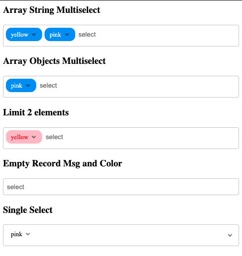
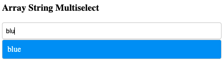

## Solid Components library

[Demo codesandbox](https://codesandbox.io/s/solidjs-multiselect-demo-db55z?file=/src/main.tsx)



### Use:
```jsx
import { Multiselect } from '@digichanges/solid-components'

<h3>Limit 2 elements</h3>
<Multiselect
    style={{ chips: { color: "red", "background-color": "pink" } }}
    options={["yellow", "blue", "pink", "white"]}
    onSelect={console.log}
    onRemove={console.log}
    selectedValues={["yellow"]}
    selectionLimit={2}
/>
```

### Search:

